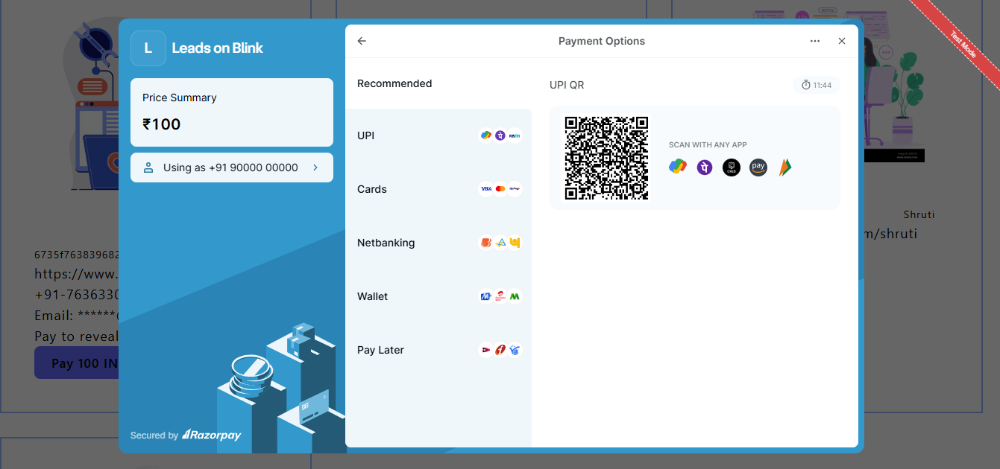

# Leads On Blink

- We are creating an application that help end user to buy top lead email info registered on portal.

- User have to pay via razorpay, so that he/she can see the selected lead details.

- Frontend deployed on: https://leads-on-blink.vercel.app/

# Backend is kept closed, to avoid extra server charges.
- For running backend, simply create .env, simply create following variables and set them, then simpy run 
"npm run dev"

``
PORT=

RAZORPAY_KEY_ID=
RAZORPAY_SECRET=

MONGO_DB_USERNAME=
MONGO_DB_PASSWORD=

JWT_SECRET_KEY=
``

